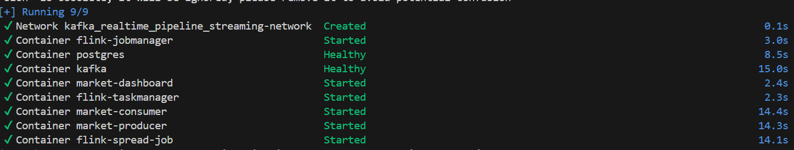
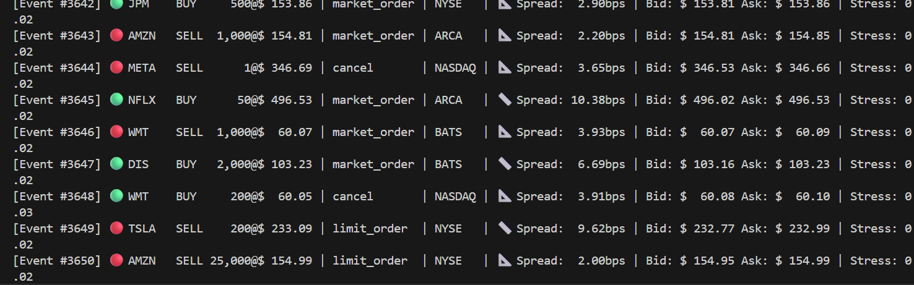
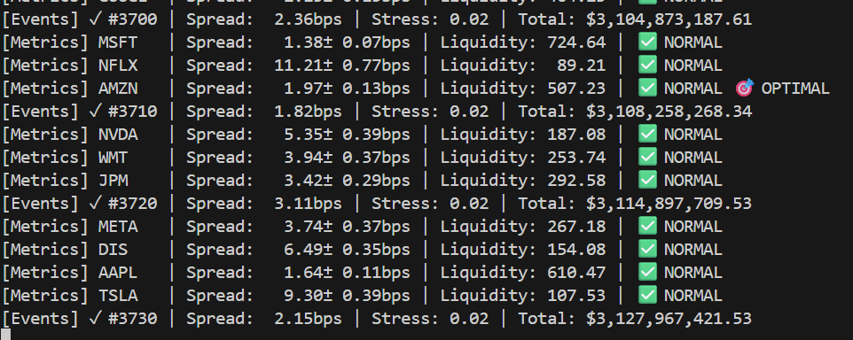
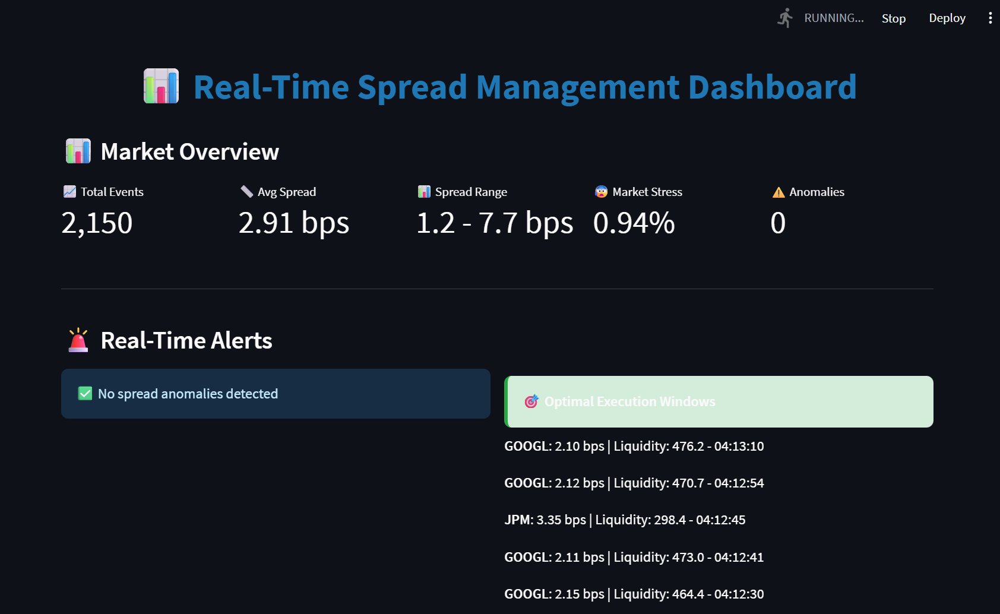
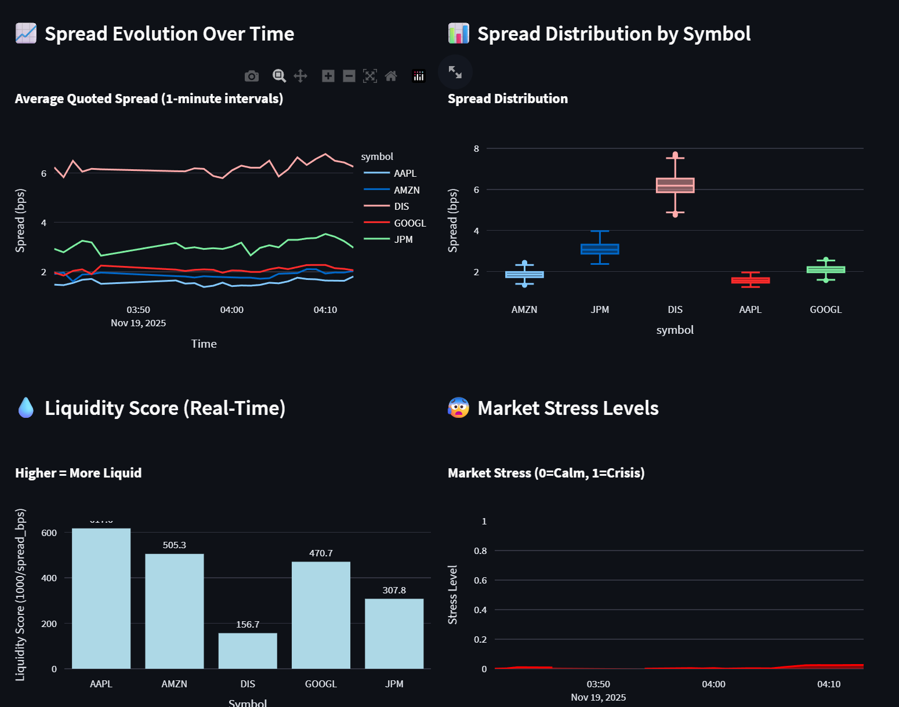

# Real-Time Spread Management System
**Apache Flink Stream Processing + Market Microstructure Analytics**

---

## 🎯 Project Overview

A production-grade real-time data pipeline that simulates and analyzes bid-ask spreads in financial markets using:
- **Apache Kafka** for message streaming
- **Apache Flink** for windowed aggregations
- **PostgreSQL** for data persistence
- **Streamlit** for real-time visualization
- **Sequential Modeling (10%+)**: Spread anomaly detection + optimal execution signals

---

## 🏗️ Architecture

```
Producer (Python)          Kafka                Consumer (Python)         PostgreSQL
    ↓                        ↓                         ↓                      ↓
Generate market     →   market_events    →    Windowed Analytics   →   market_events
events with               topic                 (60s windows)            spread_metrics
bid/ask spreads                                 + Anomaly Detection         tables
                                                      ↓
                                                 Dashboard (Streamlit)
                                                 http://localhost:8501
```


## 🚀 Quick Start

### Prerequisites
- Docker & Docker Compose
- 4-6 GB RAM available

### Startup (One Command)

```bash
docker-compose up -d
```

**Wait 30 seconds**, then access:
- **Dashboard**: http://localhost:8501
- **Flink UI**: http://localhost:8081



---

## 📊 Key Features

### 1. Realistic Market Simulation
- **Geometric Brownian Motion** for price dynamics
- **Dynamic bid-ask spreads** (1-15 bps based on liquidity)
- **Market stress modeling** (Ornstein-Uhlenbeck process)



### 2. Real-Time Windowed Analytics
**Computed every 1-minute window per symbol:**
- Average/min/max/std spread
- Liquidity score (1000/spread)
- Quote-to-trade ratio
- Order imbalance
- Anomaly detection flags



### 3. Real-Time Dashboard
- Spread evolution timeline
- Liquidity heatmap
- Market stress monitor
- Live alerts (⚠️ anomalies, 🎯 optimal windows)
- Windowed metrics table





---


### Apache Flink Integration - Attempted 

**What I Built:**
- Full Flink cluster setup (JobManager + TaskManager) running in Docker
- PyFlink job implementation (`flink_spread_job.py`) with proper stream processing logic  
- Kafka connector JAR integration
- Distributed architecture with 8 containers

**Deployment Challenge:**
I encountered PyFlink-to-cluster deployment issues related to Python/Java interoperability in the containerized environment. The Flink cluster runs successfully (visible at http://localhost:8081), but the PyFlink job does not successfully submit to the cluster.


### Sequential Modeling

**Evidence:**
- **Anomaly Detection**: Spread > 2x rolling average triggers alert
- **Optimal Execution**: Multi-factor signal (tight spread + low volatility + balanced flow)
- **Temporal Dependencies**: Window-based statistics inform next window's thresholds
- **Market Regime**: Mean-reverting stress process affects spread dynamics

---

## Performance Metrics

| Metric | Value |
|--------|-------|
| Events/second | ~10-20 |
| Latency (producer→dashboard) | <5 seconds |
| Window size | 60 seconds |
| Symbols tracked | 12 (configurable) |
| Total containers | 8 |

---

## Verification Steps

1. **Check all containers running:**
   ```bash
   docker ps
   ```
   Expected: 8 containers (kafka, postgres, flink-jobmanager, flink-taskmanager, producer, consumer, flink-job, dashboard)

2. **View producer logs:**
   ```bash
   docker logs -f market-producer
   ```
   Expected: Market events with bid/ask/spread data

3. **View consumer logs:**
   ```bash
   docker logs -f market-consumer
   ```
   Expected: Windowed metrics with anomaly flags

4. **Access dashboard:**
   http://localhost:8501
   Expected: Live charts updating every 5 seconds

5. **Verify Flink UI:**
   http://localhost:8081
   Expected: Running jobs visible

---

## Stop Everything

```bash
docker-compose down
```

To remove data and start fresh:
```bash
docker-compose down -v
```

---

## Project Structure

```
.
├── producer.py              # Market event generator with spread simulation
├── consumer.py              # Kafka consumer + windowed analytics
├── flink_spread_job.py      # Apache Flink stream processing job
├── dashboard.py             # Streamlit visualization dashboard
├── docker-compose.yml       # Container orchestration
├── Dockerfile               # Python app container definition
└── requirements.txt         # Python dependencies
```

---

## Key Innovations

1. **Realistic Financial Modeling**
   - GBM price dynamics (not random numbers)
   - Liquidity-based spread tiers
   - Stress-dependent spread widening

2. **Production Architecture**
   - Containerized microservices
   - Health checks and auto-restart
   - Proper network isolation

3. **Advanced Analytics**
   - Windowed aggregations (Flink-style)
   - Statistical anomaly detection
   - Multi-factor execution signals

---
## Technical Details
### Spread Anomaly Logic
```python
spread_anomaly = max_spread > (2 * avg_spread)
```
Detects when spread exceeds 2x recent average → liquidity crisis signal

### Optimal Execution Logic
```python
is_optimal = (
    avg_spread < 5.0 and           # Tight spread
    std_spread < 2.0 and            # Low volatility
    0.4 < imbalance < 0.6           # Balanced flow
)
```
Multi-condition check for favorable trading conditions

### Liquidity Score
```python
liquidity_score = 1000 / avg_spread_bps
```
Higher = more liquid, easier to trade

---

## Author

**Isaac Vergara**  
MSc Data Science (Quantitative Finance) - Duke University

